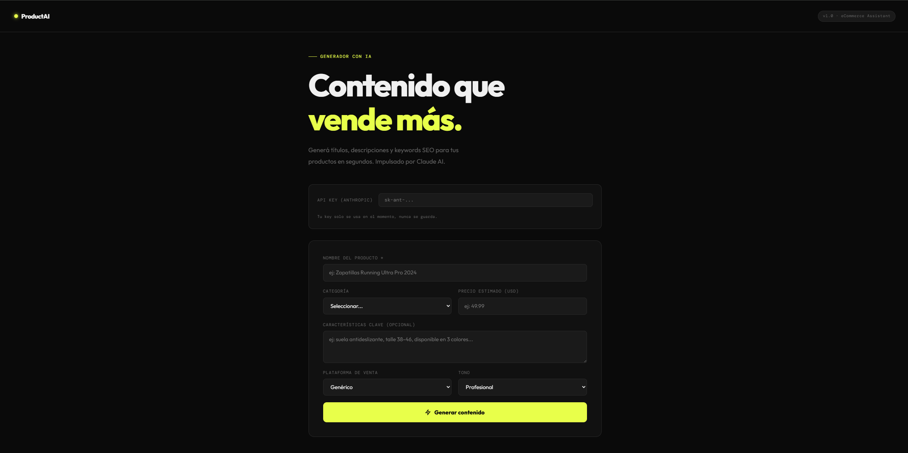

# ProductAI — Generador de Contenido para eCommerce

Herramienta web que usa inteligencia artificial para generar contenido de venta optimizado para productos de eCommerce. Ingresás el nombre del producto, configurás algunos parámetros y obtenés título, descripción, tags SEO y call to action listos para publicar.

**[→ Ver demo en vivo](https://kolobits.github.io/productai-ecommerce)**

---



---

## ¿Qué genera?

- **Título principal** — directo y optimizado para conversión (máx. 70 caracteres)
- **Descripción para listing** — 3 a 4 oraciones concisas con foco en el beneficio real
- **Descripción corta** — pensada para redes sociales o previews
- **Keywords / Tags SEO** — 8 tags relevantes para posicionamiento
- **Call to action** — frase de cierre con urgencia o beneficio claro

## Tecnologías

- HTML, CSS y JavaScript puro — sin frameworks ni dependencias
- [Anthropic API](https://anthropic.com) — modelo Claude para generación de contenido
- Deploy en GitHub Pages

## Cómo usarlo

1. Cloná el repositorio
   ```bash
   git clone https://github.com/kolobits/productai-ecommerce.git
   ```

2. Abrí `index.html` con Live Server o cualquier servidor local

3. Ingresá tu [API key de Anthropic](https://console.anthropic.com) — se usa solo en el momento, nunca se guarda

4. Completá los datos del producto y hacé click en **Generar contenido**

> La API key nunca se almacena ni se envía a ningún servidor propio. La llamada va directo desde el navegador a la API de Anthropic.

## Parámetros disponibles

| Campo | Descripción |
|-------|-------------|
| Nombre del producto | Campo obligatorio |
| Categoría | Ropa, Electrónica, Deportes, etc. |
| Precio estimado | En USD |
| Características clave | Specs o detalles relevantes |
| Plataforma | Mercado Libre, redes sociales, tienda propia |
| Tono | Profesional, cercano, premium, con urgencia |

## Decisiones de diseño

- **Sin backend** — todo corre en el cliente para que sea deployable gratis en GitHub Pages y cualquiera pueda probarlo sin instalar nada
- **API key del usuario** — práctica estándar en herramientas de este tipo; evita costos no controlados y mantiene la privacidad
- **Prompt engineering** — el prompt está construido para evitar frases genéricas y forzar textos concisos orientados a conversión en mercados hispanohablantes

## Autor

**Camilo Pardo** — [LinkedIn](https://linkedin.com/in/camilo-pardo) · [GitHub](https://github.com/kolobits)

Estudiante de Analista en Tecnologías de la Información — Universidad ORT Uruguay
